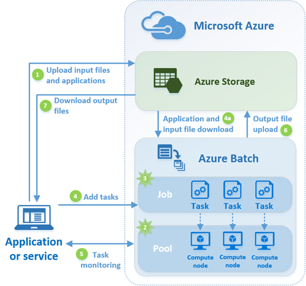

# azure-batch-examples

Azure Batch compute service examples.

# Links

- https://docs.microsoft.com/en-us/azure/batch/
- https://docs.microsoft.com/en-us/azure/batch/quick-run-python
- https://docs.microsoft.com/en-us/azure/batch/batch-api-basics
- https://docs.microsoft.com/en-us/azure/batch/tutorial-parallel-python
- https://docs.microsoft.com/en-us/azure/batch/batch-compute-node-environment-variables
- https://github.com/Azure/azure-sdk-for-net/tree/vs17Dev/src/SDKs/Batch/Support/FileConventions#conventions
- https://github.com/Azure/azure-storage-python
- https://github.com/Azure/azure-sdk-for-python/tree/master/azure-batch
- https://github.com/Azure/azure-batch-samples
- https://github.com/cjoakim/azure-batch-examples (this repo)
- https://pymotw.com/2/zipfile/

## Docker Container & Azure Batch Links

- https://github.com/Azure/batch-shipyard
- https://batch-shipyard.readthedocs.io/en/latest/00-introduction/
- https://github.com/Azure/batch-shipyard
- https://docs.microsoft.com/en-us/azure/batch/batch-docker-container-workloads

# Azure Batch Diagram



---

# Azure Setup

Create the following Azure PaaS Services:

- Storage
- Batch
- CosmosDB with SQL/DocumentDB API

---

# Workstation Requirements and Setup

These instructions assume a **macOS** workstation for submitting Azure Batch Jobs with the Python SDK.  Windows and Linux workstations, of course, can also be used.

### Required Software

- Git
- Python 3.6+

Clone this GitHub repository:
```
cd <your-chosen-directory>
git clone git@github.com:cjoakim/azure-batch-examples.git
cd azure-batch-examples
```

### Set Environment Variables

Set the following Environment Variables per your Azure Batch, Storage, and 
CosmosDB accounts and their values you see in your Azure Portal.
```
AZURE_BATCH_ACCOUNT
AZURE_BATCH_KEY
AZURE_BATCH_URL
AZURE_STORAGE_ACCOUNT
AZURE_STORAGE_ACCESS_KEY
AZURE_COSMOSDB_DOCDB_URI
AZURE_COSMOSDB_DOCDB_KEY
```

The use of environment variables for configuration is highly recommended
vs hard-coding these credentials and other values into your source code.
See the Twelve-Factor App; https://12factor.net

### Create Python Virtual Environment

```
$ cd examples
$ ./venv.sh    
```

**venv.sh** uses pip and the requirements.in file to create a python virtual environment
on your workstation.

#### requirements.in file:
```
arrow==0.12.1
azure-batch==5.0.0
azure-eventhub==1.0.0
azure-servicebus==0.21.1
azure-storage==0.36.0
pandas==0.23.4
pydocumentdb==2.3.3
PyYAML==3.13
```

---

# The Example Apps

There are currently three python-based example apps in this repo, in the examples/ directory.
1. Zip file extraction and loading extracted CSV to CosmosDB
2. Determine the mean/center location of given US States using Postal Code CSV files.
3. Similar to 2), but packaged as a Docker image.  Can execute it on a DSVM, Kubernetes, etc.

---

### Azure Batch Processing Flow and Terminology

- Each Job is submitted from your workstation with an **Azure Batch Client SDK** application, and runs in Azure Batch as a **Job**.
- Azure Batch Client SDKs are implemented in **.Net, Python, Node.js, Java, and REST**.  In this GitHub project both the client SDK and task programming language is python, but they could be different.  
- Each Job consists of one or more **Tasks**.
- The **Tasks** of the **Job** run within a **Pool** of **Virtual Machines** that you specify.
- You can specify the Virtual Machines OS and size, and number of VMs in the Pool.

### My Code Naming Conventions

- 
---

## Example App 1 

### Prepare the Azure Blob Storage Containers

Before executing the first job, we need to create the Azure Blob Storage Containers
that will be used in the app.
```
$ ./unzip_job_prepare.sh
```

This script contains Azure CLI commands like this:
```
az storage container delete --name batchtask
az storage container delete --name batchzips
az storage container delete --name batchcsv

az storage container create --name batchtask
az storage container create --name batchzips
az storage container create --name batchcsv
```

The first example app consists of **two Azure Batch Jobs**:
- an unzip job
- a csv ETL job.

### The Unzip Job

The first Job uploads Zip files, containing separate CSV files, to Azure Blob Storage.
The Job then reads these zip files, and extracts their CSV entries to Blob files.

These three Zip files are uploaded.
```
examples/data/NC1.zip
examples/data/NC2.zip
examples/data/NC3.zip
```

Execute the job with this script:
```
$ source bin/activate  # activate the python virtual env
$ ./unzip_client.sh
```

Each zip file contains five csv files, and each csv file contains a header line and 
approximately 20 lines of data like this:
```
id,postal_cd,country_cd,city_name,state_abbrv,latitude,longitude
11029,27229,US,Candor,NC,35.2562750000,-79.7998240000
11030,27230,US,Cedar Falls,NC,35.7518000000,-79.7317000000
11031,27231,US,Cedar Grove,NC,36.1956520000,-79.1699700000
11032,27233,US,Climax,NC,35.8938970000,-79.6998560000
11033,27235,US,Colfax,NC,36.0958730000,-80.0047100000
11034,27237,US,Cumnock,NC,35.5532000000,-79.2348000000
11035,27239,US,Denton,NC,35.6202570000,-80.0850570000
11036,27242,US,Eagle Springs,NC,35.3340640000,-79.6397000000
11037,27243,US,Efland,NC,36.0658920000,-79.1995670000
11038,27244,US,Elon,NC,36.2048000000,-79.4860890000
11039,27247,US,Ether,NC,35.4403000000,-79.7839000000
11040,27248,US,Franklinville,NC,35.7797640000,-79.7083040000
11041,27249,US,Gibsonville,NC,36.1710530000,-79.5856080000
11042,27252,US,Goldston,NC,35.5640480000,-79.3448920000
11043,27253,US,Graham,NC,35.9672710000,-79.3357490000
11044,27256,US,Gulf,NC,35.5666260000,-79.2827790000
11045,27258,US,Haw River,NC,36.0447680000,-79.3233640000
11046,27259,US,Highfalls,NC,35.4793000000,-79.5233000000
11047,27260,US,High Point,NC,35.9565700000,-79.9927520000
11048,27261,US,High Point,NC,35.9557000000,-80.0057000000
```

### The CSV ETL Job

The second Job reads these CSV blobs, and creates a CosmosDB document from each row
in the CSV.  Each row represents one US Postal code in North Carolina.

Execute the job with this script:
```
$ ./csv_etl_client.sh
```

### The Resulting DocmentDB Data

Documents are inserted into CosmosDB from this CSV data,
each document looks similar to this:

```
{
    "state_abbrv": "NC",
    "seq": "11219",
    "longitude": "-78.6388000000",
    "city_name": "Raleigh",
    "location": {
        "type": "Point",
        "coordinates": [
            -78.6388,
            35.7719
        ]
    },
    "latitude": "35.7719000000",
    "pk": "Raleigh",
    "country_cd": "US",
    "postal_cd": "27602",
    "id": "762ce672-b80d-4f43-97cb-a950ed8929f7",
    "_rid": "VAtpAPmVigsTAQAAAAAAAg==",
    "_self": "dbs/VAtpAA==/colls/VAtpAPmVigs=/docs/VAtpAPmVigsTAQAAAAAAAg==/",
    "_etag": "\"630115c2-0000-0000-0000-5b9ad1150000\"",
    "_attachments": "attachments/",
    "_ts": 1536872725
}
```

## Query the Zipcode Documents in CosmosDB

The query syntax is SQL-like:
```
Count the documents in the collection with the partition-key value of 'Raleigh':
SELECT COUNT(1) FROM c where c.pk = 'Raleigh'

Select those same documents:
SELECT * FROM c where c.pk = 'Raleigh'
SELECT * FROM c where c.pk = 'Raleigh' and c.postal_cd = '27602'
```

Spatial Query with GPS coordinates, distance in meters:
```
SELECT * FROM c WHERE ST_DISTANCE(c.location, {'type': 'Point', 'coordinates': [-78.661484, 35.859100] }) < 5000
```
Note: 35.859100, -78.661484 = Shelley Park, Raleigh, NC.  https://binged.it/2QqlBkx


## Querying CosmosDB

You can query the resulting documents that are in CosmosDB by running this Python script:

```
$ source bin/activate
$ python cosmosdb.py --func query_all_zipdata_docs
```

---

## Example App 2

The second example app consists of just **one Azure Batch Job**, but it assumes that you have 
uploaded the seven 'data/postal_codes_*.csv' files to the batchcsv Blob storage container.

You can upload these seven postal code CSV files with this command:
```
python blob_io.py --func upload_state_csv --cname batchcsv
```

You can submit the job with this command:
``` 
./states_client.sh
```

The job will read each of the CSV blobs and use the Python Pandas library to calculate the
geographic center of each state by determining the mean latitude and longitude values.
The CSV blob is read into a Pandas Dataframe.

One Task will be executed for each state CSV blob.  Each Task will write a results CSV file
and a log JSON file to the blob storage container.

For example, the results CSV file for North Carolina will consist of one line like this:
```
states_1528904060,task5,postal_codes_nc.csv,35.5734559414,-79.5452560288
``` 

The JSON log file will look like this:
```
{
  "args.dev": "false", 
  "args.filepath": "postal_codes_nc.csv", 
  "args.idx": "4", 
  "args.sastoken": "se=2018-06-13T17%3A34%3A22Z&sp=w&sv=2017-04-17&sr=c&sig=ujpK/DKm8u7%2BHio0iBm%2BRFM...xxx...lFTtE%3D", 
  "args.storageaccount": "cjoakimstdstorage", 
  "args.storagecontainer": "batchcsv", 
  "env": "azure", 
  "env.AZ_BATCH_ACCOUNT_NAME": "cjoakimbatch2", 
  "env.AZ_BATCH_ACCOUNT_URL": "https://cjoakimbatch2.eastus.batch.azure.com/", 
  "env.AZ_BATCH_CERTIFICATES_DIR": "/mnt/batch/tasks/workitems/states_1528904060/job-1/task5/certs", 
  "env.AZ_BATCH_JOB_ID": "states_1528904060", 
  "env.AZ_BATCH_NODE_ID": "tvm-587366007_3-20180613t153715z", 
  "env.AZ_BATCH_NODE_IS_DEDICATED": "true", 
  "env.AZ_BATCH_NODE_ROOT_DIR": "/mnt/batch/tasks", 
  "env.AZ_BATCH_NODE_SHARED_DIR": "/mnt/batch/tasks/shared", 
  "env.AZ_BATCH_NODE_STARTUP_DIR": "/mnt/batch/tasks/startup", 
  "env.AZ_BATCH_POOL_ID": "statespool_1528904060", 
  "env.AZ_BATCH_TASK_DIR": "/mnt/batch/tasks/workitems/states_1528904060/job-1/task5", 
  "env.AZ_BATCH_TASK_ID": "task5", 
  "env.AZ_BATCH_TASK_USER": "_azbatch", 
  "env.AZ_BATCH_TASK_USER_IDENTITY": "PoolNonAdmin", 
  "env.AZ_BATCH_TASK_WORKING_DIR": "/mnt/batch/tasks/workitems/states_1528904060/job-1/task5/wd", 
  "env.HOME": "/mnt/batch/tasks/workitems/states_1528904060/job-1/task5/wd", 
  "env.PATH": "/usr/local/sbin:/usr/local/bin:/usr/sbin:/usr/bin:/sbin:/bin:/mnt/batch/tasks/shared:/mnt/batch/tasks/workitems/states_1528904060/job-1/task5/wd", 
  "env.PWD": "/mnt/batch/tasks/workitems/states_1528904060/job-1/task5/wd", 
  "env.SHLVL": "1", 
  "env.USER": "_azbatch", 
  "env._": "/usr/bin/python", 
  "epoch": 1528904260, 
  "fq_input_file": "/mnt/batch/tasks/workitems/states_1528904060/job-1/task5/wd/postal_codes_nc.csv", 
  "log_json_filename": "log-info-states_1528904060-task5.json", 
  "results_csv_filename": "results-info-states_1528904060-task5-postal_codes_nc.csv"
}
```

Note that Azure Batch sets and uses well-defined **environment variables**, such as AZ_BATCH_TASK_WORKING_DIR,
that can be used in your Task code.

See https://docs.microsoft.com/en-us/azure/batch/batch-compute-node-environment-variables

---

## Example App 3

This is a simplified version of App 2, intended to show how to package your Python code
within a Docker image, and execute it in another environment - Azure Data Science Virtual Machine (DSVM),
Azure Container Instance, Azure Kubernetes Service (AKS), or Azure Batch.

See **statecenter.py**, this is executed by the container.

Files **Dockerfile** and **.dockerignore** are used to create the Docker image.

I've pushed working image **cjoakim/statecenter:latest** to my public DockerHub account, where
you can download it and execute it as follows:

```
docker run -e st=ct cjoakim/statecenter:latest    <- Connecticut
docker run -e st=fl cjoakim/statecenter:latest    <- Florida
docker run -e st=nc cjoakim/statecenter:latest    <- North Carolina
```

---

# Comments on the Python code used

I rewrote the Azure Batch sample code found here: https://github.com/Azure/azure-batch-samples
into a more Object-Oriented form.  This OO form is implemented in file **examples/batch_client.py**.
I believe that class **BatchClient**, found in batch_client.py, enables better code reuse.

You are free to modify this code as necessary.  This code should not be considered "production quality"
as it is intended for demonstration purposes only.

I also used constent names for the scripts for a given Azure Batch job; for example:
```
states_client.sh   <- the bash shell script which executes states_client.py
states_client.py   <- the client SDK python script which submits the job to Azure Batch
states_task.py     <- the python Task that actually runs on Azure in Batch; this is uploaded to Storage.
```

# Virtual Machine Sizes

See script **examples/list_vm_sizes.sh** and its output file **examples/vm-sizes.json**.

# Azure CLI

See **examples/unzip_job_prepare.sh** for examples of using the Azure CLI with Azure Storage accounts.

# Selecting and Customizing the Azure Batch Virtual Machines

See base file **examples/batch_client.py**, the intent of this file is to provide reusable code
for your Azure Batch processing.

You can specify your VM OS, size, and node-count like this:
```
            self.POOL_NODE_COUNT   = int(self.args.nodecount)
            self.POOL_VM_SIZE      = 'Standard_DS3_v2'  # Standard_A4 BASIC_A1
            self.NODE_OS_PUBLISHER = 'Canonical'
            self.NODE_OS_OFFER     = 'UbuntuServer'
```

You can install Python PIP libraries, and execute other VM setup commands, like this:
```
    def create_pool(self, opts={}):
        print('Creating pool "{}"...'.format(self.POOL_ID))
        task_commands = [
            'cp -p {} $AZ_BATCH_NODE_SHARED_DIR'.format(self.TASK_FILE),
            'curl -fSsL https://bootstrap.pypa.io/get-pip.py | python',
            'pip install azure-storage==0.36.0',
            'pip install pydocumentdb==2.3.2',
            'pip install pandas==0.23.0'
        ]
```

# Command-line Arguments for the Tasks

See file **examples/states_client.sh**, which forms the command-line String for the Task.
```
            template = 'python $AZ_BATCH_NODE_SHARED_DIR/{} --filepath {} --storageaccount {} --storagecontainer {} --sastoken "{}" --idx {} --dev false'
            command  = [
                template.format(
                    self.TASK_FILE,
                    blob.name,
                    self.STORAGE_ACCOUNT_NAME,
                    self.args.cin,
                    cin_container_sas_token,
                    str(idx)
                )
```
